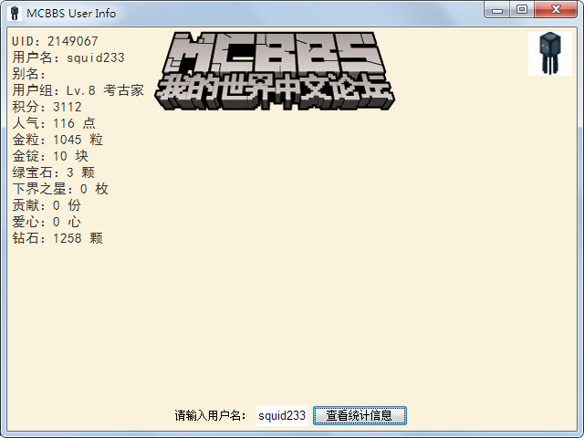

# MCBBS User Info
这个程序可以让你搜索到MCBBS里的用户，不过不是实时更新，需要你的帮助。  
你可以New Issue来申请添加用户。
# 使用方法

1. 下载jar包
2. 写一个bat，将x替换为对应的版本号：

        @echo off
        java -jar MCBBSUserInfo-x.x.x+build.x.jar
        pause

3. 双击bat，开始运行！

# 画廊
